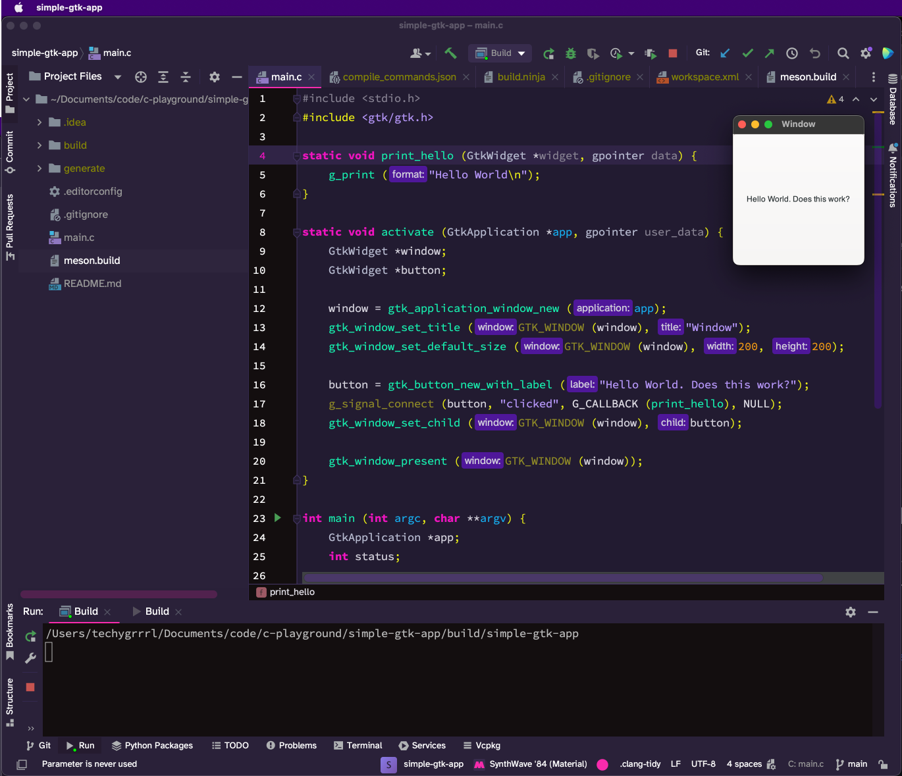

# GTK4 hello world

This is a hello world app in GTK4.

These are the instructions for macOS.

- [Install GTK](#install-gtk)
- [Install Meson](#install-meson)
- [Install Ninja](#install-ninja)
- [Set up the project with Meson](#set-up-the-project-with-meson)
- [Compile the code](#compile-the-code)
- [Set up in CLion](#set-up-in-clion)
  - [Project setup](#project-setup)
  - [Command setup](#command-setup)



## Install GTK

Install GTK 4 and all of its dependencies:

    brew install gtk+4

Ensure that everything is linked with `pkg-config`:

    pkg-config --cflags --libs gtk4

This should output the paths of GTK-related packages.


## Install Meson

Install Meson with pip3:

    pip3 install meson --local

This installs it to `~/.local/bin`. Ensure this is on your path. If you type `meson` and it outputs something, it works. If not, try adding pip3 packages to your path by adding the following to your `~/.zshrc` or `~/.bash_profile` file:

```sh
# Add pip3 packages to my path
export PATH="$HOME/Library/Python/3.11/bin:$PATH"
```

## Install Ninja

Download an executable from the [release page](https://github.com/ninja-build/ninja/releases) and drop it into any directory on your path, e.g. `~/.local/bin`.


## Set up the project with Meson

The project on my system is in a directory `simple-gtk-app` so code paths below will reference that.

Set up the project with Meson:

    meson setup build

You should see output like this:

```text
➜  simple-gtk-app meson setup build
The Meson build system
Version: 1.1.0
Source dir: /path/to/code/simple-gtk-app
Build dir: /path/to/code/simple-gtk-app/build
Build type: native build
Project name: test
Project version: undefined
C compiler for the host machine: cc (clang 14.0.0 "Apple clang version 14.0.0 (clang-1400.0.29.202)")
C linker for the host machine: cc ld64 820.1
Host machine cpu family: x86_64
Host machine cpu: x86_64
Found pkg-config: /usr/local/bin/pkg-config (0.29.2)
Run-time dependency gtk4 found: YES 4.10.3
Build targets in project: 1
```

This should've created a directory `build` since the above command tells it to set up in `./build`.


## Compile the code

Go into the `./build` directory and run the `ninja` command to build:

    cd build
    ninja

You should see output like this:

```text
[2/2] Linking target simple-gtk-app
```

Now, while still in the `./build` directory, execute the compiled binary:

    ./simple-gtk-app


## Set up in CLion

Before proceeding, you will need to have compiled the app at least once with the above instructions to get the executable. This is necessary in order to set up the **Build** command described below.


### Project setup

Open the file `./build/compile_commands.json` in CLion. You should see a prompt to set this as the project root.


### Command setup

Next we'll set up commands **Build** and **Clean**.

You will need to follow the instructions on the Jetbrains site [here](https://blog.jetbrains.com/clion/2021/01/working-with-meson-in-clion-using-compilation-db/) to set up the custom tools for Ninja.

Main things to remember:

- Program executable is `ninja`
- Working directory is `./build`
- You need to create a custom external tool Build and a custom external tool Clean
- The run configuration will need to use the custom external tool Build as the Target
- The run configuration will need to point to the compiled executable `./build/simple-gtk-app` (this is why you needed to compile at least once to find it)

Press the play button... It **should** work.. 🤞
